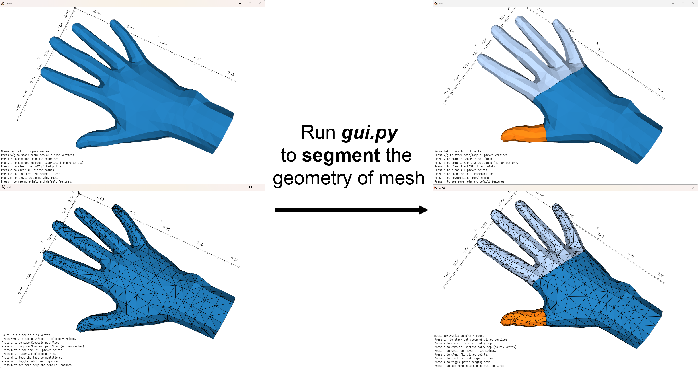
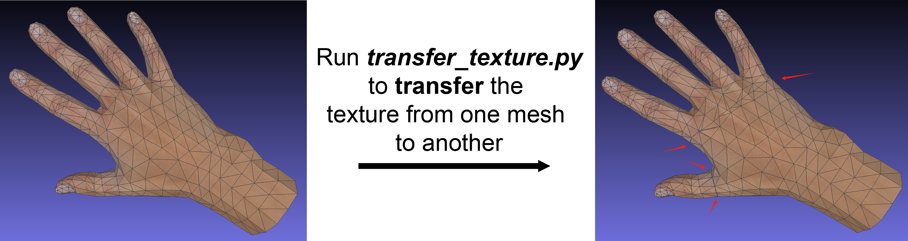

# Mesh Segmentation Tool - GUI


## Environment
```
pip install -r requirements.txt
```

## Segmentation GUI
```bash
python gui.py --input <input_path>
```


## Texture Transferring
```bash
python transfer_texture.py --tex-mesh <tex_mesh_path> --new-mesh <new_mesh_path>
```


## Auto Segmentation

On going

## Build data that can be directly used to train NeuralSurface
```bash
python build_data.py --input <model_path>
```

```model_path``` is the path to a ```.obj``` file (```.ply``` should work too)

After building the data, you need to manually copy the three generated folders under ```data_built/<model_path>``` to the designated folder in ```NeuralSurface```
